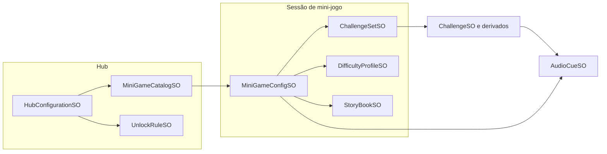

# Guia dos ScriptableObjects

Este documento lista os **ScriptableObjects** do framework, o menu **Create** correspondente, os campos principais e como se encaixam no fluxo **Hub → mini-jogo → progresso/analytics**.

Para fluxo geral do projeto, veja também `Tutorial_Framework_PTBR.md`.

---

## Visão das dependências

---

## 1. Desafios (`ChallengeSO` e derivados)

Classe base (sem menu próprio): **`ChallengeSO`**

| Campo | Uso |
|-------|-----|
| **Id** | Identificador lógico (fallback: nome do asset). |
| **Concept keys** | Strings para **métricas** (ex.: `phoneme:/b/`, `count:3`); vão para `ProgressService` via `RaiseAnswerEvaluated`. |
| **BNCC tags** | Referências opcionais a `BnccTagSO` (metadados / exportação). |
| **Prompt narration** | `AudioCueSO` opcional — pergunta ou instrução em áudio. |

### `MultipleChoiceChallengeSO`

- **Menu:** `Create → Edu → Data → Challenge → Multiple Choice`
- **Uso:** `MiniGameMultipleChoice`, lacunas em `MiniGameStoryGaps` (`StoryPageSO.GapChallenge`).
- **Campos extra:** imagem de estímulo; listas de **sprites** e/ou **ids de texto** por opção; **índice correto**; opcionalmente áudio por opção ao hover (`_optionHoverAudio`).

### `QuantityChallengeSO`

- **Menu:** `Create → Edu → Data → Challenge → Quantity`
- **Uso:** `MiniGameCounting`.
- **Campos extra:** **quantidade alvo**; sprite do token; template de narração por número; **clips** indexados por número (1 → índice 0, etc.).

### `MemoryPairChallengeSO`

- **Menu:** `Create → Edu → Data → Challenge → Memory Pair`
- **Uso:** `MiniGameMemory` — duas cartas com o mesmo **`PairId`** formam par.
- **Campos extra:** `PairId`; dois `AudioCueSO` (faces A/B).

### `ClassificationChallengeSO`

- **Menu:** `Create → Edu → Data → Challenge → Classification`
- **Uso:** `MiniGameClassification`.
- **Campos extra:** lista de **itens** (`sprite` + `categoryId`); **rótulos** dos bins (uma string por coluna/categoria).

### `SyllableChallengeSO`

- **Menu:** `Create → Edu → Data → Challenge → Syllable Builder`
- **Uso:** `MiniGameSyllableBuilder`.
- **Campos extra:** partes da palavra **em ordem**; sprites por parte; áudio da palavra alvo.

---

## 2. Agrupamento e narrativa de conteúdo

### `ChallengeSetSO`

- **Menu:** `Create → Edu → Data → Challenge Set`
- **Conteúdo:** lista ordenada de **`ChallengeSO`** (vários tipos podem coexistir se o mini-jogo filtrar por tipo).
- **Ligação:** referenciado por **`MiniGameConfigSO`**.

### `StoryPageSO`

- **Menu:** `Create → Edu → Data → Story Page`
- **Campos:** ilustração (`Sprite`); **lacuna** (`MultipleChoiceChallengeSO`).

### `StoryBookSO`

- **Menu:** `Create → Edu → Data → Story Book`
- **Conteúdo:** sequência de **`StoryPageSO`**.
- **Ligação:** campo **`Story Book`** em **`MiniGameConfigSO`** (usado por `MiniGameStoryGaps`).

---

## 3. Sessão e dificuldade

### `DifficultyProfileSO`

- **Menu:** `Create → Edu → Data → Difficulty Profile`
- **Campos:** número de **rodadas**; streak de erros antes de **simplificar** opções; **máx./mín.** de alternativas em múltipla escolha.
- **Ligação:** **`MiniGameConfigSO`**; usado por `MiniGameMultipleChoice`, contagem, memória, etc.

### `MiniGameConfigSO`

- **Menu:** `Create → Edu → Data → Mini Game Config`
- **Papel:** configuração **por mini-jogo** ligada ao componente na cena (`MiniGameBase._configAsset`).
- **Campos:**
  - **Game id** — deve coincidir com o **`gameId`** no catálogo e com o nó do hub (`LinkedGameId`).
  - **Challenge set** — obrigatório para jogos baseados em set (não obrigatório para fluxo só de história se o código usar só `StoryBook`).
  - **Difficulty** — perfil de rodadas / opções.
  - **Success / neutral retry cue** — `AudioCueSO` para feedback pós-resposta (`PlayFeedback` em `MiniGameBase`).
  - **Story book** — para jogo de história com lacunas.

---

## 4. Hub e catálogo

### `MiniGameCatalogSO`

- **Menu:** `Create → Edu → Data → Mini Game Catalog`
- **Conteúdo:** lista de **entradas** (`MiniGameCatalogEntry`):
  - **Game id**
  - **Display name key** — chave para `LocalizationService` (com fallbacks em código para as chaves `mg.*` padrão).
  - **Additive scene name** — nome da cena **sem** `.unity` (ex.: `MG_Consonants`); deve estar no **Build Settings** e, no projeto atual, usar prefixo **`MG_`** para descarregar ao voltar ao hub.
  - **BNCC tags** (opcional), faixa etárea sugerida.

### `HubConfigurationSO`

- **Menu:** `Create → Edu → Data → Hub Configuration`
- **Campos:** referência ao **`MiniGameCatalogSO`**; lista de **`HubMapNode`** (id do nó, **game id** ligado, posição UI em âncoras, **`UnlockRuleSO`**).

### `UnlockRuleSO` (abstrato)

Implementações com menu:

| Tipo | Menu | Comportamento |
|------|------|----------------|
| **`AlwaysUnlockedRuleSO`** | `Edu → Data → Unlock → Always Unlocked` | Nó sempre disponível. |
| **`RequireMiniGamesCompletedRuleSO`** | `Edu → Data → Unlock → Require Completed Games` | Exige pelo menos **uma sessão concluída** por cada `gameId` listado (`IProgressReader.GetCompletedSessions`). |

---

## 5. Áudio

### `AudioCueSO`

- **Menu:** `Create → Edu → Audio → Audio Cue`
- **Campos:** `AudioClip`; escala de volume; **`AudioPriority`** (Ambient, Celebration, Correction, Tutorial — valor maior interrompe narração de tier mais baixo); se empilha no mesmo tier; bloqueio de input até acabar; cooldown; chave opcional de legenda.
- **Uso:** prompts em `ChallengeSO`, feedback em `MiniGameConfigSO`, faces em memória, etc. Consumido por **`AudioDirector`** / **`NarrationController`**.

### `AudioPriority` (enum, não é SO)

Referência para preencher prioridade nos cues: Tutorial (60) > Correction (40) > Celebration (10) > Ambient (0).

---

## 6. BNCC e localização

### `BnccTagSO`

- **Menu:** `Create → Edu → Data → BNCC Tag`
- **Campos:** código oficial; nome para exibição.
- **Uso:** referências em **`ChallengeSO`** e entradas do **catálogo** (metadados / relatórios).

### `LocalizedTableSO`

- **Menu:** `Create → Edu → Data → Localized Table`
- **Conteúdo:** linhas (**key**, **pt-BR**, **secondary** opcional — ex.: outro idioma).
- **Uso:** atribuir no **`LocalizationService`** na cena Bootstrap (array **`_tables`**); `TryGet` usa `languageId` que começa com `pt` para `ptBR`; caso contrário prefere `secondary` se preenchido.

---

## 7. Canais de eventos (SO como “event bus”)

Assets vazios que seguram **subscribers** em C#; úteis para desacoplar UI, analytics e mini-jogos.

### `AnswerEvaluatedEventChannelSO`

- **Menu:** `Create → Edu → Events → Answer Evaluated`
- **Payload:** `MiniGameId`, acerto, **concept keys**, latência em segundos.
- **Ligação:** opcional em **`MiniGameBase`** (`_answerEvents`); preenchido quando o jogo chama `RaiseAnswerEvaluated`.

### `MiniGameSessionEventChannelSO`

- **Menu:** `Create → Edu → Events → MiniGame Session Event`
- **Payload:** `GameId` + fase em string (ex.: `Started`, `Completed` — ver usos em `MiniGameBase`).
- **Ligação:** opcional em **`MiniGameBase`** (`_lifecycleEvents`).

### `VoidEventChannelSO`

- **Menu:** `Create → Edu → Events → Void Event`
- **Uso:** evento sem payload; pode ligar sistemas genéricos (não referenciado pelo núcleo atual dos mini-jogos em código base, mas disponível para extensões).

---

## 8. Ordem sugerida de criação (autoria)

1. **`AudioCueSO`** necessários para prompts e feedback.  
2. **`ChallengeSO`** (subtipo certo por jogo) + **`ChallengeSetSO`**.  
3. **`DifficultyProfileSO`**.  
4. **`StoryBookSO` / `StoryPageSO`** se for jogo de história.  
5. **`MiniGameConfigSO`** (`gameId` + referências acima).  
6. **`MiniGameCatalogSO`** (entrada com mesma cena aditiva e `gameId`).  
7. **`UnlockRuleSO`** conforme desejado.  
8. **`HubConfigurationSO`** (catálogo + nós).  
9. Opcional: **`LocalizedTableSO`** e **`BnccTagSO`**; canais em **Edu → Events**.

---

## 9. Geração automática de exemplos

O menu **`Edu Framework → Generate Default Content`** cria um conjunto coerente desses assets em `Assets/EduFramework/ScriptableObjects/Generated/` e liga o hub — útil como referência viva ao encadear SOs.
